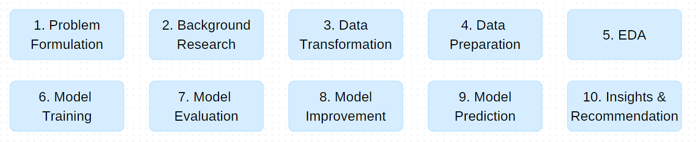

# Satellite Terrain Image Classification

This project was done as part of our SC1015 Introduction to Data Science and AI module in NTU (Semester 2, AY2023/2024).

## Table of Contents

1. [Overview](#overview)
2. [Problem Statement](#problem)
3. [Workflow](#workflow)
4. [Key Insights](#insights)
5. [References](#references)

## Project Structure

| Folder | Purpose                                     |
| ------ | ------------------------------------------- |
| docs   | Presentation slides.                        |
| images | Images used in the notebook.                |
| models | Models saved from our training.             |

## Dataset
Original dataset: https://www.kaggle.com/datasets/apollo2506/landuse-scene-classification 
Modified dataset: https://www.kaggle.com/datasets/racheltanminzhi/landuse

## Overview

### Unmanned Aerial Vehicles (UAVs)

Unmanned Aerial Vehicles (UAVs) are aircraft that are guided autonomously, by remote control, or by both means and that carry some combination of sensors, electronic receivers and transmitters, and offensive ordnance. They are used for strategic and operational reconnaissance and for battlefield surveillance, and they can also intervene on the battlefield.

### Benefits of UAVs

UAVs are becoming more commonplace in modern military arsenals for use in strategic and operational reconnaissance and for battlefield surveillance and intervention. With increased digitalisation and automation in defence forces, it would be beneficial for UAVs to be able to independently identify its own surroundings, reducing the need to constant human surveillance. 

## Problem Statement

How can we train an accurate terrain classification model using satellite imagery, for future use in UAVs to contribute to Singapore's defence efforts?

## Workflow

An augmented version of the UCMerced (University of California Merced) Land Use dataset from [Kaggle](https://www.kaggle.com/datasets/apollo2506/landuse-scene-classification) was used for model training and development. The dataset contained 21 classes with 500 images per class (100 original images and 400 augmented images), of which two classes were ommitted (agriculture and chaparral) as they were not relevant to the context of our project. We merged the remaining 19 classes into 10 classes based on similarity (e.g., buildings + denseresidential + mediumresidential = highdensitybuildings). The final 10 classes are as follows: highdensitybuildings, lowdensity buildings, roads, recreational, harbour, beach, forest, river, runway, and storagetanks. 

Minor data preparation was conducted (data normalisation and image resizing from 256x256 to 100x100px) before carrying out Exploratory Data Analysis. Next, simple sklearn models like K-Nearest neighbours, Decision Tree Classifier, Random Forest Classifier, and Gaussian Naive Bayes, were trained on the image data to act as baseline models for future comparison. 

We then developed a Convolutional Neural Network (CNN) (blahblahblah blah). 

Finally, we tested two State of the Art models (SOTA), ResNet 50 and Inception-V3, and used them as benchmark models to evaluate the efficacy of our CNN. 

comparison between our CNN and SOTA blah blah.

## Key Insights

As expected, all four sklearn models performed very poorly with final test accuracies of 20.20% (Gaussian Naive Bayes) to 31.19% (Random Forest Classifier). As the Random Forest Classifier had the best performance time, we attempted to improve it through hyper-parameter tuning with stratified K fold cross validation to reduce overfitting. However, this only produced marginal improvements in accuracy. 

CNN performance blah 

The two SOTA models were highly accurate (ResNet50: 97.21%, Inception-V3: 95.47%) and capable of distinguishing between the classes, with no observable overfitting. 

Overall, the models were least confident in the following 4 classes: low-density buildings, high density buildings, river, and storage tanks. For river and storage tanks, it is likely a result of the lack of images and that these classes can easily be confused for other classes (rivers can be mistaken for harbours, runways, and forests | storage tanks can be mistaken as low density buildings or harbours)
For buildings, it is likely that the model gets confused between the two classes (Low-density Buildings and High-density Buildings).

## Contributors

- [Rachel Tan Min Zhi](https://github.com/racheltmz)
- [Saffron Salmah Yen Lim](https://github.com/Ripleyyyyy)
- [Sanjana Shanmugasundaram](https://github.com/snnjana)

## References

Guilmartin, J., & Taylor, J. (2024, April 18). Unmanned aerial vehicles (UAVs). Retrieved from Encylopaedia Brittanica : https://www.britannica.com/technology/unmanned-aerial-vehicle

Fayaz, M., Nam, J., Dang, L. M., Song, H.-K., & Moon, H. (2024). Land-cover classification using deep learning with high-resolution remote-sensing imagery. Applied Sciences, 14(5), 1844. https://doi.org/10.3390/app14051844

HHLH Sky GmbH. (2023, December 6). Strategic Benefits of Using Automated Drones for Enterprise Operations. (HHLH Sky GmbH) Retrieved from https://www.linkedin.com/pulse/strategic-benefits-using-automated-drones-enterprise-operations-zlhse/

Mohsan, S. A., Othman, N. Q., Yanglong, L., Alsharif, M. H., & Muhammad, A. K. (2023). Unmanned aerial vehicles (UAVs): practical aspects, applications, open challenges, security issues, and future trends. Intell Serv Robot, 16(1), 109–137.

IBM. (n.d.). What are convolutional neural networks? Retrieved from IBM: https://www.ibm.com/topics/convolutional-neural-networks

Ng, W. K. (2022, September 28). Singapore Army and RSAF link drones for the first time to give soldiers more intel. Retrieved from The Straits Times: https://www.straitstimes.com/singapore/army-and-airforce-link-drones-for-the-first-time-to-give-soldiers-more-intel

Papers with Code. (n.d.). Papers with code—Eurosat benchmark (Image classification). Retrieved from Papers with Code: https://paperswithcode.com/sota/image-classification-on-eurosat]

